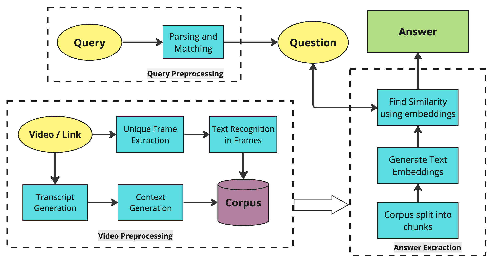
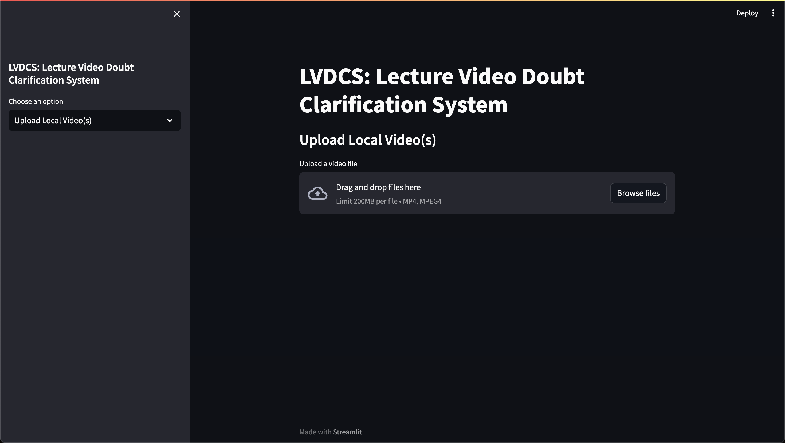
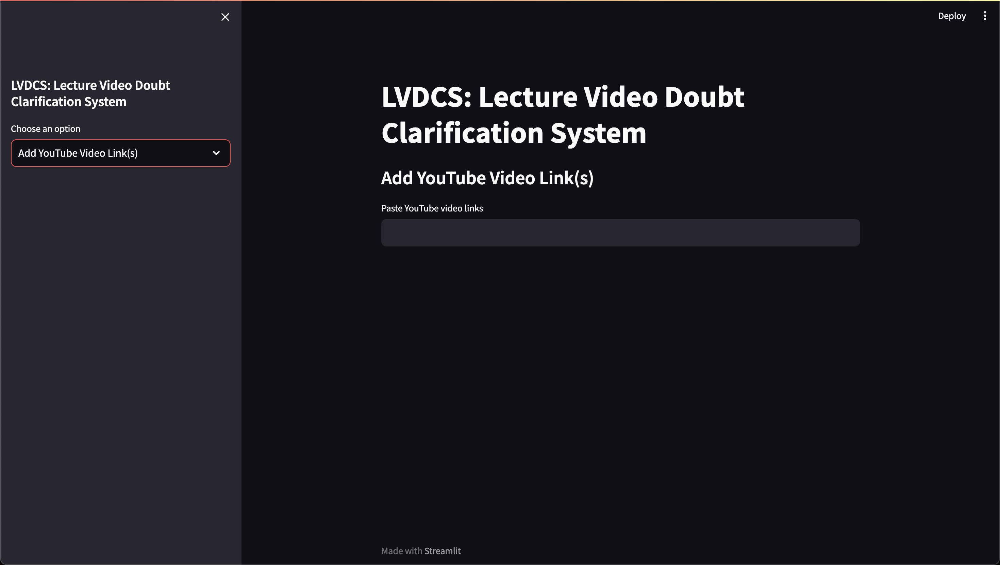

# LVDCS: Minimising the Doubts in Distance Learning

This repository contains the source code for our Capstone Project implemented in our final year of Engineering. LVDCS stands for Lecture Video Doubt Clarification System wherein users can get  answers for any doubts they have while watching lecture videos immediately. Below depicts the workflow of the entire process.



Table of Contents
====
+ [Installation](#installation)
+ [Usage](#usage)


Installation
===

### 1. Clone the repository in the same directory as your Azure ML notebook/script
```sh
git clone https://github.com/anaghapatill/LVDCS.git
```

### 2. Navigate to the *azure_kpi_metrics* folder
```sh
cd azure_kpi_metrics
```

### 2. Install the required Python libraries
```sh 
pip install -r requirements.txt
```

Usage
===


### 1. Add the AssemblyAI API key in the `main.py` file and the HuggingFace API token in the `upload_llm.py` and the `link_llm.py` files
```python
api_key = "<AssemblyAI API Key>"
os.environ["HUGGINGFACEHUB_API_TOKEN"] = "<HuggingFace API Token>"
```

### 2. Run the `main.py` file

``` python
streamit run main.py
```
<br />

## **Using the Lecture Video Doubt Clarification System**
<p></p>

### 1. Upload your video(s) from your local system using the `Upload Local Video(s)` option on the Streamit page



<p></p>

### 2. Add YouTube link(s) of any video(s) using the `Add YouTube Video Link(s)` option on the Streamit page



<p>

**Important: Users must ensure that the videos must be in the English language and YouTube videos must contain closed captions in English for the system to work efficiently.**
